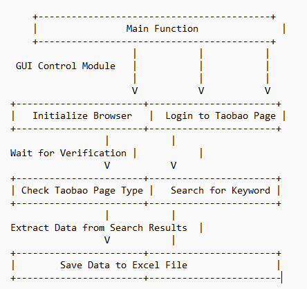
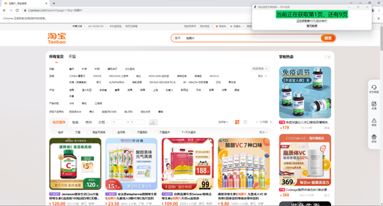
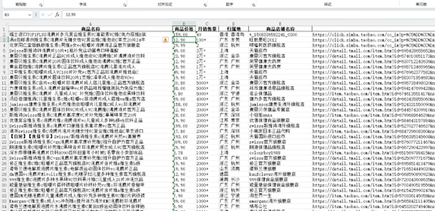

# 基于 Selenium 和 Tkinter 的爬取淘宝商品的Web自动化工具

README of supported languages: [简体中文](./README.md)
## 使用指南
### 安装依赖
1. 确保已经正确安装Python
2. 安装requirements.txt中的依赖

### 安装WebDriver驱动
注意需要使用与您浏览器安装版本相对应的WebDriver，
本工具代码为Google Chrome提供适配：
[Google Chrome WebDriver](https://chromedriver.storage.googleapis.com/index.html)

如果使用其它游览器，请自行寻找所使用游览器的WebDriver驱动，并更改源代码文件中游览器有关参数为你所使用游览器的参数

>
    options = webdriver.ChromeOptions()
    browser = webdriver.Chrome(options=options)

[Selenium-Install Drivers指引](https://www.selenium.dev/documentation/webdriver/getting_started/install_drivers/)  

### 修改settings.ini

格式：
>
    <所需关键词>
    <起始页码>
    <终止页码>

例如
> 
    阿迪达斯运动鞋
    1
    10

## 启动
>
    python ./taobaoCrawler.py

## 流程图

## 效果图

## 参考
[cnblog : 使用Python 爬取 京东 ，淘宝。 商品详情页的数据。（避开了反爬虫机制）](https://www.cnblogs.com/Gao1234/p/15784052.html)

[Github : MarketSpider](https://github.com/zhangjiancong/MarketSpider)

[zhihu : Python爬虫实例（三）||爬取淘宝商品信息](https://zhuanlan.zhihu.com/p/82664740)